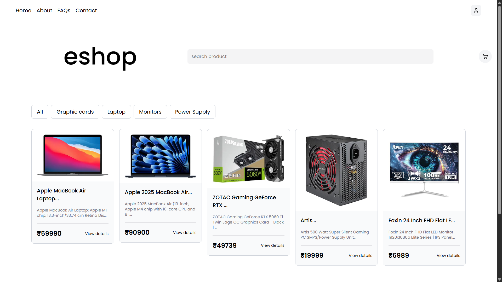
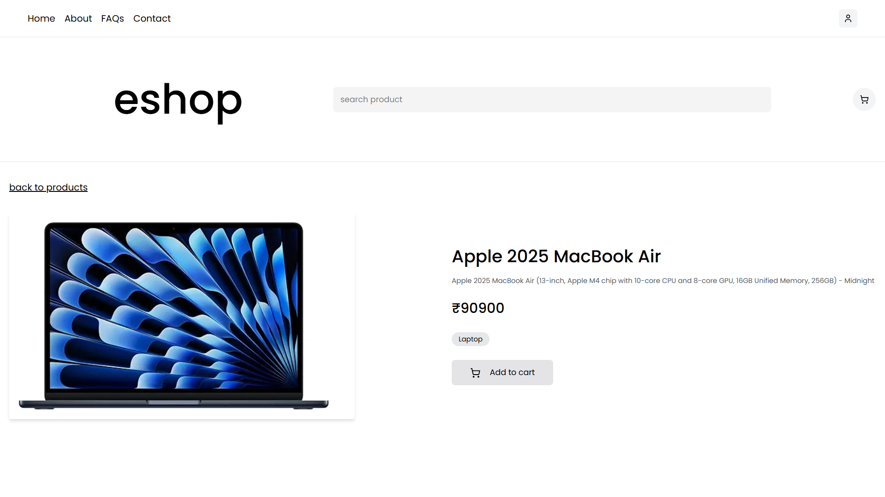
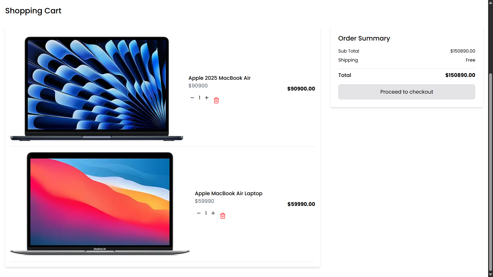

# e shop

## interface





This is a simple e-commerce interface project built with [Vite](https://vitejs.dev/).

---

## 🛠️ How to Run

### 1. Clone the repository

```bash
https://github.com/dixitparmar-dev/eshop.git
```

```
npm install
npm run dev
```

- http://localhost:5173/
